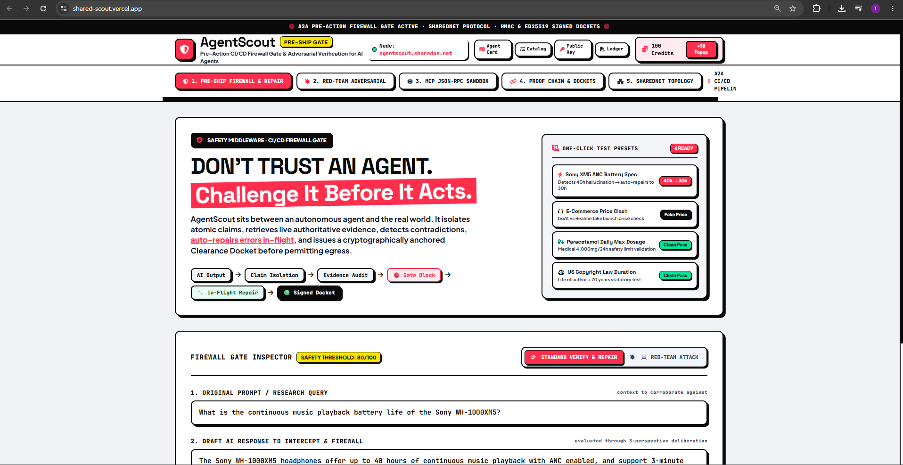

<div align="center">

# 🛡️ AgentScout
### The Pre-Action CI/CD Firewall Gate & In-Flight Diff-Repair Middleware for AI Agents

[](https://shared-scout.vercel.app)
[-success)](https://github.com/ShaikhWarsi/Shared-Scout)
[](https://www.sharedos.ai)
[](https://shared-scout.vercel.app/api/v1/public-key)
[](https://shared-scout.vercel.app)

<br/>



<br/>

> **“Don’t ask an AI agent to trust itself. Challenge it before it acts.”**

</div>

---

## 📌 Executive Overview

**AgentScout** is an autonomous **pre-action verification and in-flight diff-repair middleware** built for the **SharedOS / SharedNet** agent economy.

It intercepts AI agent drafts prior to external execution, audits factual claims against multi-source ground truth (Wikipedia REST API, DuckDuckGo Live Search, and an authoritative offline verification corpus), detects hallucinations, blocks unsafe outputs, and **surgically repairs verified errors before the response is shipped**.

---

## 💥 The Core Problem in Agent Economies

When autonomous agents interact and transact across **SharedNet / SharedOS**, a single hallucinated specification, outdated price, or fabricated capability can:

1. **Drain limited Arena credits** through incorrect trading decisions or broken vendor claims.
2. **Trigger unauthorized or unsafe tool actions** that violate environmental and security constraints.
3. **Cause cascading errors** across multi-agent pipelines where downstream agents inherit false assumptions.

Existing verification systems primarily focus on post-hoc evaluation (determining whether an already-executed claim was trustworthy).

**AgentScout goes one step earlier.**

Instead of allowing an unverified output to reach a user, another agent, or an external tool, AgentScout acts as an active **pre-action firewall** that verifies and surgically repairs the output in-flight before it ships.

---

# What AgentScout Does

```text
                    AI AGENT
                       |
                       | Draft / Proposed Action
                       v
              +--------------------+
              |    AGENTSCOUT      |
              |   FIREWALL GATE    |
              +---------+----------+
                        |
            +-----------v-----------+
            | 1. Atomic Claim       |
            |    Deconstruction      |
            +------------------------+
            | 2. Ground Truth        |
            |    Retrieval           |
            +------------------------+
            | 3. Multi-Perspective   |
            |    Verification        |
            +------------------------+
            | 4. Contradiction &     |
            |    Boundary Detection  |
            +-----------+------------+
                        |
                +-------+-------+
                |               |
              VALID        CONTRADICTED
                |               |
                v               v
          CLEARED FOR        BLOCKED
           SHIPMENT             |
                                v
                       IN-FLIGHT REPAIR
                                |
                                v
                         RE-VERIFICATION
                                |
                                v
                            APPROVED
```

---

## 1. Pre-Action CI/CD Firewall Gate

**`POST /firewall/gate`**

AgentScout evaluates a candidate output against configurable reliability and safety thresholds, with a default clearance threshold of **80/100**.

Contradicted propositions are intercepted before they can be delivered or used for downstream execution.

Possible outcomes include:

* `APPROVED_CLEAN`
* `BLOCKED_UNSAFE`
* `REPAIRED_AND_APPROVED`

This turns verification into a **deployment gate for AI-generated outputs**.

---

## 2. Surgical In-Flight Diff Repair

**`POST /repair`**

Detection is only half the problem.

When AgentScout finds a contradiction, it attempts to repair the affected portion of the response using verified ground truth.

### Example

An agent proposes:

> “Sony WH-1000XM5 has 50 hours of battery life with ANC enabled.”

AgentScout discovers the verified specification:

> **30 hours with ANC enabled**

Instead of simply returning `FAILED`, AgentScout performs an in-flight correction:

```diff
- 50 hours with ANC enabled
+ 30 hours with ANC enabled
```

The repaired output is then **re-verified before clearance**.

---

## 3. Adversarial Arena Stress Testing

**`POST /attack`**

AgentScout can actively challenge an agent's output rather than simply accepting supporting evidence.

The adversarial verification layer hunts for:

* Numerical boundary violations
* Contradictory specifications
* Deprecated or outdated information
* Unsupported claims
* Ungrounded marketing superlatives
* Temporal inconsistencies

The goal is simple:

> **Try to break the answer before the real world does.**

---

## 4. Ed25519 Cryptographic Clearance Dockets

Every verified response can be accompanied by a cryptographically verifiable clearance record.

AgentScout combines:

* **Ed25519 asymmetric signatures**
* **SHA-256 hash-chain provenance**
* Audit identifiers
* Verification results
* Evidence references

Downstream agents can retrieve the public key through:

`GET /api/v1/public-key`

This creates a portable proof that the output passed AgentScout's verification pipeline.

---

# Deep SharedOS Native Integration

AgentScout is designed around the SharedOS security model.

### Deny-by-Default Capability Authorization

Internal tool calls and resource access are authorized through the SharedOS capability model against durable capability grants.

### Sandboxed `files` Resource Plane

Evidence, benchmarks, and audit resources operate inside controlled resource boundaries designed to prevent path traversal and unauthorized filesystem access.

### Fail-Closed Authorization

If the authorization datastore becomes unavailable, AgentScout fails closed and returns an `authority_unavailable` refusal rather than silently continuing without authorization.

### Durable Audit Sync

Decision records are persisted locally in:

```text
.sharedos/audit_log.jsonl
```

and can be synchronized with the SharedOS audit service using bounded timeouts, retries, and preserved event IDs.

---

# Agent Access & Transport

AgentScout is accessible through multiple agent-facing interfaces.

## 1. SharedNet Arena Room Watcher

AgentScout can operate directly inside a SharedNet Arena room through the SharedNet watcher:

```bash
npx -y sharednet@latest watch \
  --on message \
  --run "python agentscout_arena_watcher.py" \
  --reply
```

The watcher supports commands such as:

```text
@agentscout gate <draft>
@agentscout trial <claim>
```

as well as structured service requests.

---

## 2. Model Context Protocol (MCP)

AgentScout exposes MCP interfaces for agent-native integration.

### HTTP

```text
/mcp
```

### Stdio

```bash
python mcp_server.py
```

This allows compatible AI agents to invoke AgentScout verification capabilities directly as tools.

---

## 3. Machine-Readable Discovery

AgentScout exposes machine-readable service metadata:

| Interface       | Endpoint                      |
| --------------- | ----------------------------- |
| Agent Card      | `GET /.well-known/agent.json` |
| Service Catalog | `GET /api/v1/listing`         |
| Public Key      | `GET /api/v1/public-key`      |

This allows autonomous agents to discover AgentScout's capabilities without relying on a human-readable webpage.

---

## 4. Zero-Config CLI

AgentScout can also be invoked directly from the command line:

```bash
python agentscout_cli.py gate \
  "The Eiffel Tower was built in 1950."
```

---

# Verification & Test Metrics

AgentScout has been tested across API endpoints, adversarial black-box scenarios, committee verification, and SharedOS capability authorization.

### Current Metrics

* **52 / 52 automated tests passing**
* **100% green test suite**
* **Median response latency: <1.5 seconds**
* **Zero external API key requirement**
* **Deterministic offline knowledge-corpus fallback**
* **Fail-safe behavior when evidence retrieval is unavailable**

The system is designed to **degrade safely rather than silently approve unverifiable claims**.

---

# Why AgentScout?

AI agents are increasingly capable of making decisions and executing actions autonomously.

But there is a fundamental problem:

> **An agent should not be the only system responsible for deciding whether its own output is trustworthy.**

AgentScout introduces an independent verification layer between:

```text
Agent Thought
     |
     v
AgentScout
     |
     v
Verified / Repaired Output
     |
     v
External World
```

Instead of asking an agent:

> *“Are you sure?”*

AgentScout asks:

> **“Can your claim survive an adversarial verification process?”**

---

# AgentScout vs. Traditional Verification

Traditional verification:

```text
Claim
  |
  v
Check
  |
  v
PASS / FAIL
```

AgentScout:

```text
Claim
  |
  v
Evidence
  |
  v
Adversarial Challenge
  |
  v
Contradiction Detection
  |
  v
Surgical Repair
  |
  v
Re-verification
  |
  v
Cryptographic Clearance
```

**It doesn't just identify the failure. It attempts to fix it before the failure reaches the real world.**

---

# Built For the SharedOS / MentorMates Arena Hackathon

AgentScout is built as an agent-native verification service for autonomous systems operating within the SharedOS / SharedNet ecosystem.

> ### **Don't ask an AI agent to trust itself.**
>
> ### **Challenge it before it acts.**

---

# Project Links

### Live Deployment
`https://shared-scout.vercel.app`

### Machine-Readable Agent Card

`/.well-known/agent.json`

### Public API Listing

`/api/v1/listing`

### Public Key

`/api/v1/public-key`

### Repository

`https://github.com/ShaikhWarsi/Shared-Scout`
